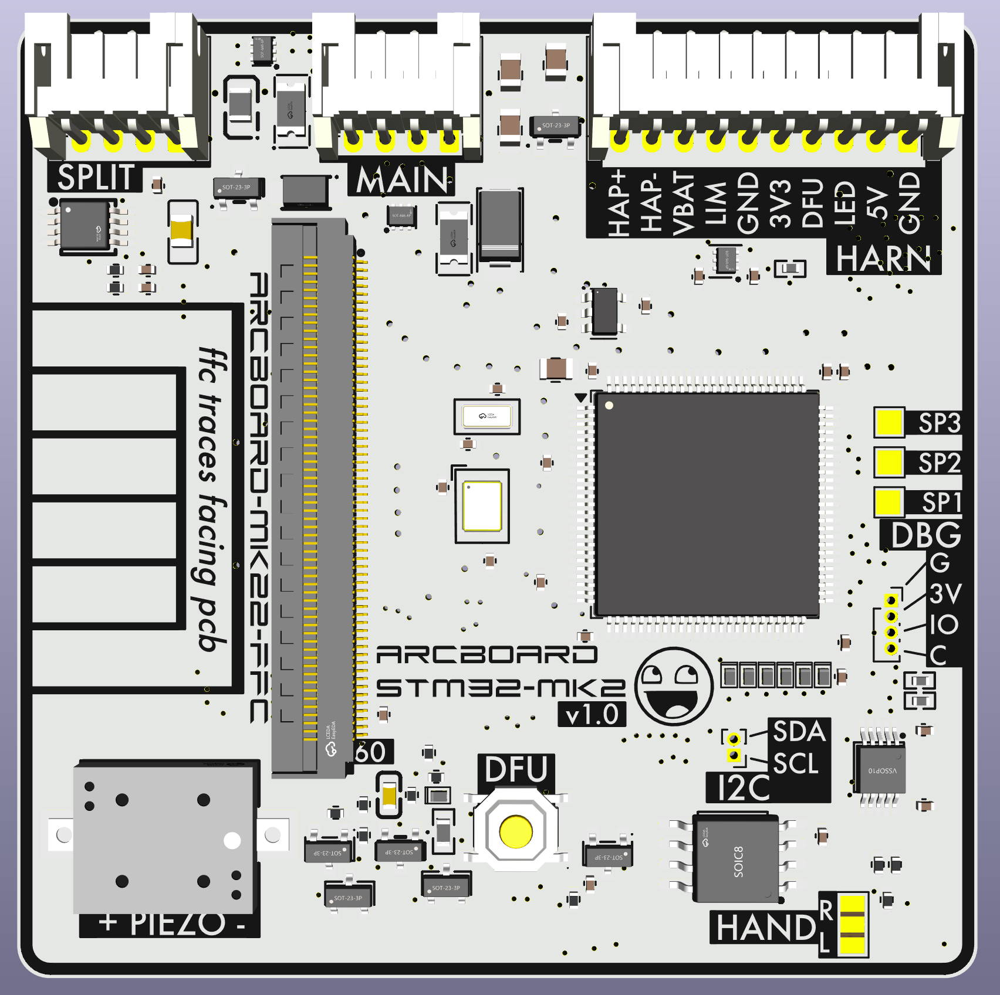
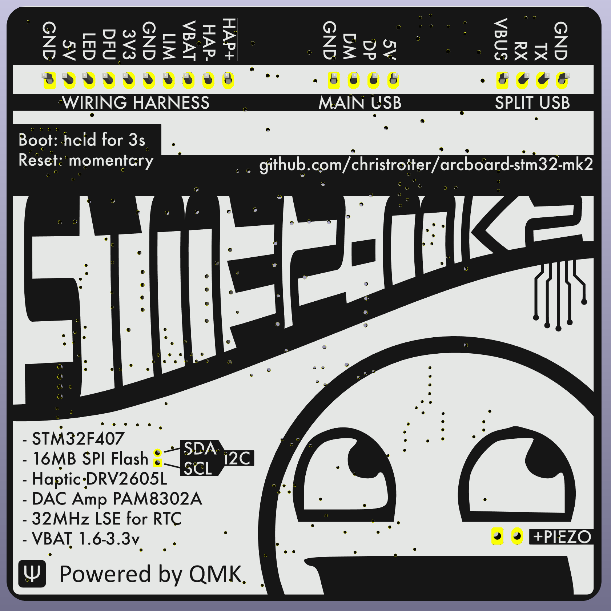

# arcboard-stm32-mk2

Next iteration of the [STM32F405 mainboard](https://github.com/christrotter/arcboard-stm32).

## Features
- STM32F407 w. 12mHz HSE crystal
- 60x60mm footprint
- **60-pin FFC connector** for [the bespoke FFC loom](https://github.com/christrotter/arcboard-mk22-ffc)
  - Connects: 3x encoders, 4x6 keywell & 5 thumb keys, dpad, 3x paddle buttons, LCD, indicator LED PCBs, PMW3360
- **onboard button** for reset(*momentary*) and boot(*hold*) (*remote output also*)
- 128mb external **flash** via SPI (16MB)
- DRV2605L **haptic** driver via I2C, with PWM trigger (LRA or ERM)
- PAM8302A 2.5w **amplifier & piezo** (*or outputs*)
- 32kHz LSE crystal & **VBAT** wiring (*via external 1.8-3.3v battery*)
- **Two-layer** PCB & PCBA design for more affordable manufacturing
- Both USB connections have **ESD & power protection**
- Designed for **remote-mount** USB ports and boot/reset button
- **Split hand** GPIO via solder jumper
- **VBUS detection** via GPIO
- RGB-5v and LCD-3.3v supplies through MOSFET w. GPIO triggers
- WS2812 signal **level-shifted** to 5v
- Optional outputs
  - I2C
  - Debug
  - Haptic
  - Amplifier out
  - Ground + RGB-5v + WS2812 chain (*continuing from main loom*) for adding more LEDs (*e.g. aesthetic, underglow, etc*)
  - **Limit switch** (pull-up) output

## Improvements
- 100-pin CPU package offers much more flexibility, more options when wiring up the board
- The only soldering required is for JST-PH connectors (*2.0mm pin spacing*)
- Smaller diode package and setup saves space, keeps us on two-layer
- Actually working DFU system this time (*bad LCD pcb caused problems*)
- Fixed a number of issues, including mysterious overheating caused by a poor quality Schottky diode (*and bad spec choice on my part*)
- Inkscape-designed back silkscreen

## QMK notes
- I'm using `ROW2COL` because the Cyboard pcb's are designed this way.

## PCB/PCBA cost
My costs for getting the board made and assembled by JLC, to give you an idea of what this would cost to have built for you.

| Item | Cost (CAD) |
|---|---:|
| Setup fee | $25.56 |
| Stencil | $8.21 |
| Components | $67.86 |
| Extended components fee | $53.55 |
| SMT Assembly | $3.75 |
| Packaging fee | $0.49 |
| Advanced Options | $0.82 |
| Confirm Parts Placement | $0.45 |

## Bill of Materials (BOM)

| Designator | Footprint | Quantity | Value | LCSC Part # |
|---|---|---:|---|---|
| C1, C10, C20, C23 | 0805 | 4 | 4.7uF | C1779 |
| C11, C12, C14, C17, C18, C19, C26, C28, C5, C7, C8, C9 | 0402 | 12 | 100nF | C1525 |
| C13, C15, C2, C24, C27, C4 | 0402 | 6 | 1uF | C52923 |
| C16, C21 | 0402 | 2 | 2.2uF | C12530 |
| C22 | C0603 | 1 | CL10A106MA8NRNC | C96446 |
| C25 | C0805 | 1 | GCM21BR70J106KE22L | C126230 |
| C29, C3, C30, C6 | 0402 | 4 | 12p | C1547 |
| D1 | SMA_L4.3-W2.6-LS5.2-RD | 1 | SS34 | C8678 |
| D10, D11, D2, D3, D6, D8, D9 | X1-DFN1006-2_L1.0-W0.6-RD | 7 | CDSQC4148-HF | C6341459 |
| D4 | SOD-123FL_L2.8-W1.8-LS3.7-BI | 1 | SMF5_0CA_C364279 | C364279 |
| D5, D7 | SOT-666-6_L1.6-W1.2-P0.50-LS1.6-BL | 2 | USBLC6-2P6_C2827693 | C2827693 |
| F2 | F1206 | 1 | 1206L150SLYR | C207037 |
| F3 | F1206 | 1 | MF-NSMF075-2 | C89653 |
| L1 | L0805 | 1 | MPZ2012S101AT000 | C15957 |
| LED-LVL1 | SOT-563_L1.6-W1.2-P0.50-LS1.6-BR | 1 | SN74LVC1T45DRL | C352970 |
| MOSFET1, MOSFET3, MOSFET4 | SOT-23_L2.9-W1.3-P1.90-LS2.4-BR | 3 | AO3401A | C15127 |
| R1 | 0402 | 1 | 0402WGF1004TCE | C26083 |
| R10 | 0402 | 1 | 5.1k | C25905 |
| R11, R12, R16, R17, R2, R3, R5 | 0402 | 7 | 10k | C25744 |
| R4, R7, R8 | R0402 | 3 | 0402WGF4701TCE | C25900 |
| R14 | 0402 | 1 | 0402WGF1000TCE | C25076 |
| R15 | 0402 | 1 | 0402WGF1001TCE | C11702 |
| R6 | R0603 | 1 | 0603WAF3303T5E | C23137 |
| R9 | 0402 | 1 | 0402WGF1003TCE | C25741 |
| U1 | SOT-23-5 | 1 | XC6210B332MR-G | C82942 |
| U10, U9 | SOT-23-3_L2.9-W1.3-P1.90-LS2.4-BR | 2 | MMUN2233LT1G | C86932 |
| U13, U4 | SOT-23-3_L2.9-W1.3-P1.90-LS2.4-BR | 2 | 2N7002 | C8545 |
| U14 | SOIC-8_L5.3-W5.3-P1.27-LS8.0-BL | 1 | W25Q128JVSIQTR | C97521 |
| U15 | SW-SMD_4P-L5.1-W5.1-P3.70-LS6.5-TL_H1.5 | 1 | TS-1187A-B-A-B | C318884 |
| U2 | LQFP-100_14x14mm_P0.5mm | 1 | STM32F407VGTx | C12345 |
| U3 | FPC-SMD_FH52-60S-0.5SH | 1 | FH52-60S-0_5SH | C224193 |
| U5 | VSSOP-10_L3.0-W3.0-P0.50-LS4.9-BL | 1 | DRV2605LDGSR | C527464 |
| U6 | MSOP-8_L3.0-W3.0-P0.65-LS5.0-BL | 1 | PAM8302AASCR | C113367 |
| U8 | OSC-SMD_L3.2-W1.5 | 1 | SC-32S32_768kHz20PPM7pF | C97604 |
| Y1 | CRYSTAL-SMD_4P-L3.2-W2.5-BL-1 | 1 | Crystal_GND24 | C9002 |

Total line items: 35  
Total component quantity: 77

## Renders

## PCB layout

## Schematic

