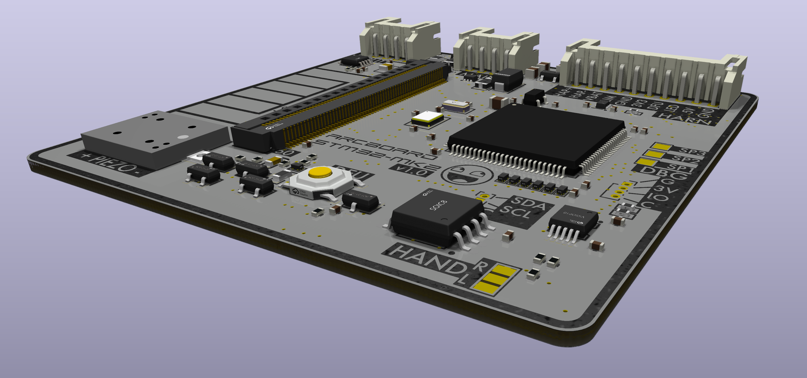
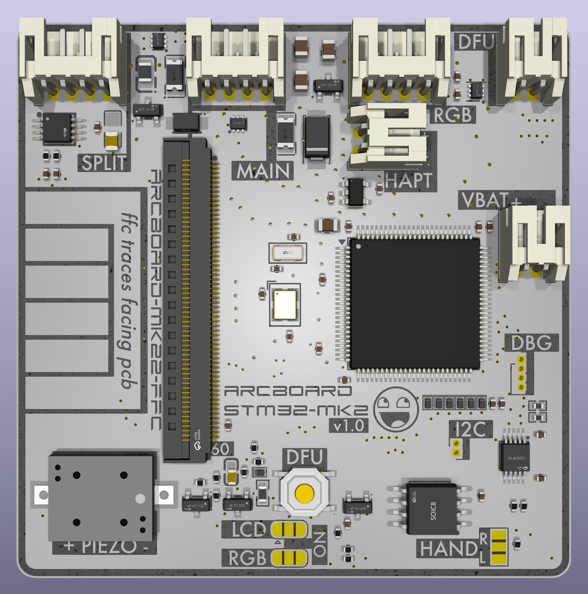
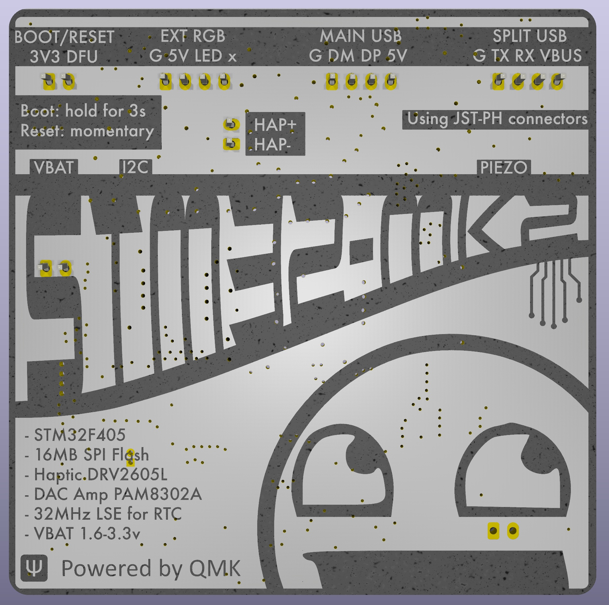
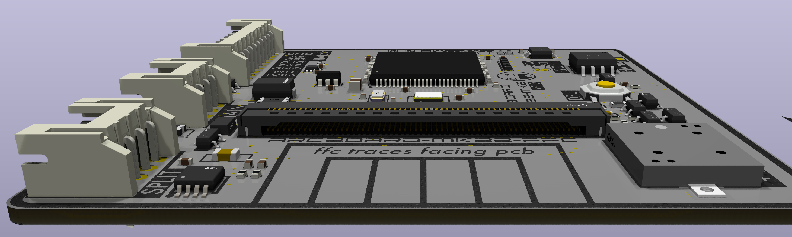
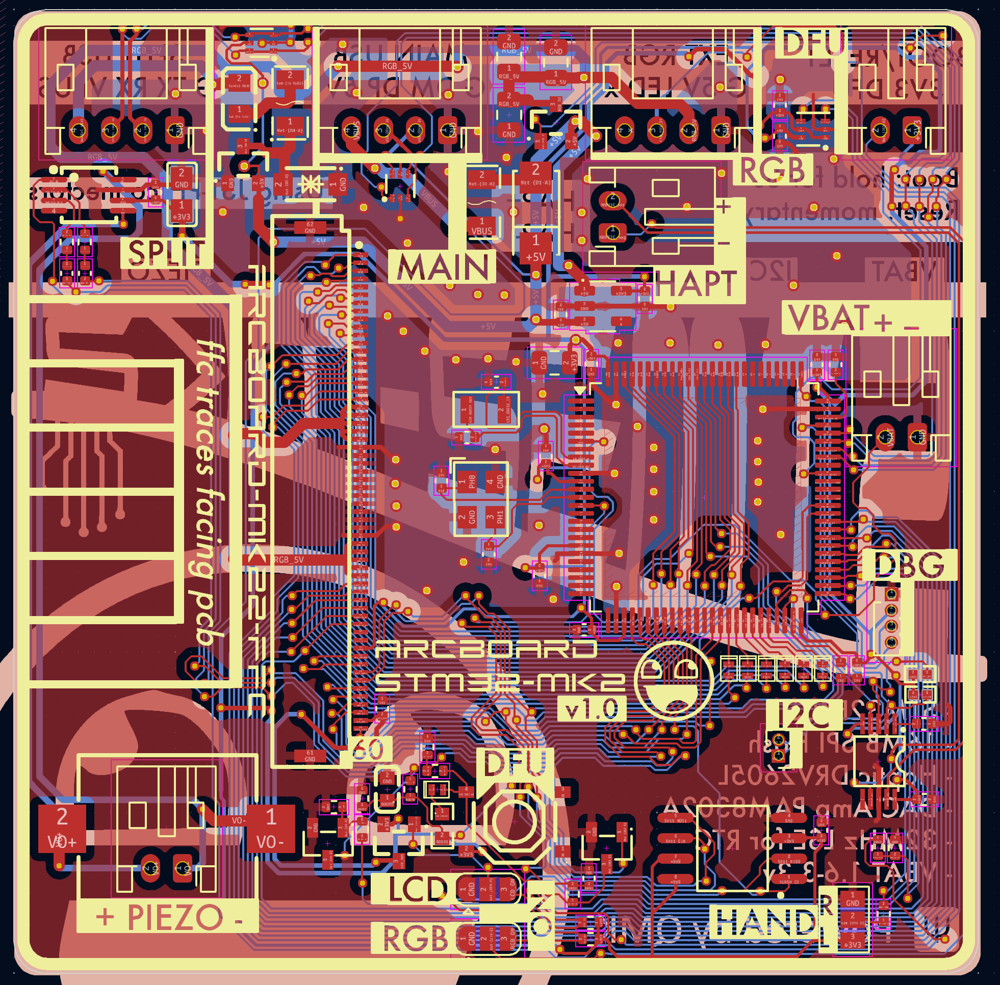
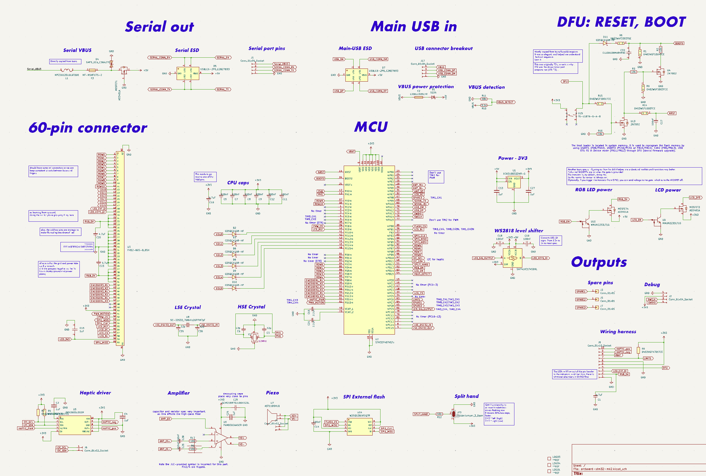

# arcboard-stm32-mk2

Next iteration of the [STM32F405 mainboard](https://github.com/christrotter/arcboard-stm32).

## Features
- STM32F405 w. 12mHz HSE crystal
- 60x60mm footprint
- 60-pin connector for [the bespoke FFC loom](https://github.com/christrotter/arcboard-mk22-ffc)
  - Connects: 3x encoders, 4x6 keywell & 5 thumb keys, dpad, 3x paddle buttons, LCD, indicator LED PCBs, PMW3360
- onboard button for reset(*momentary*) and boot(*hold*) (*remote output also*)
- 128mb external flash via SPI (16MB)
- DRV2605L haptic driver via I2C, with PWM trigger (LRA or ERM)
- PAM8302A 2.5w amplifier & piezo (*or outputs*)
- 32kHz LSE crystal & VBAT wiring (*via external 1.8-3.3v battery*)
- two-layer PCB & PCBA design for more affordable manufacturing
- both USB connections protected against ESD & power problems
- designed for remote-mount USB ports and boot/reset button
- split hand via solder jumper
- VBUS detection via GPIO
- RGB-5v and LCD-3.3v supplies through MOSFET w. GPIO triggers
- WS2812 signal level-shifted to 5v
- optional outputs
  - I2C
  - Debug
  - Haptic
  - Amplifier out
  - Ground + RGB-5v + WS2812 chain (*continuing from main loom*) for adding more LEDs (*e.g. aesthetic, underglow, etc*)

## Improvements
- 100-pin CPU package offers much more flexibility, more options
- the only soldering required is for JST-PH connectors (*2.0mm pin spacing*)
- smaller diode package and setup saves space, keeps us on two-layer
- actually working DFU system this time (*bad LCD pcb caused problems*)
- fixed a number of issues, including mysterious overheating caused by a poor quality Schottky diode (*and bad spec choice on my part*)
- Inkscape-designed back silkscreen

## Renders

## PCB layout

## Schematic

